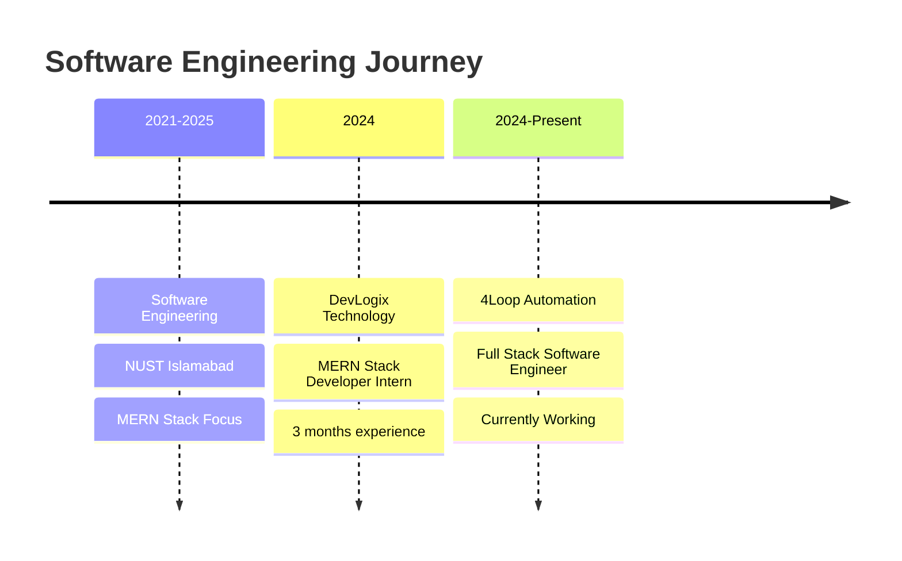

# <div align="center">Muhammad Yasir Ghaffar</div>

<div align="center">
  
[](https://git.io/typing-svg)

<picture>
  <source media="(prefers-color-scheme: dark)" srcset="https://raw.githubusercontent.com/platane/platane/output/github-contribution-grid-snake-dark.svg">
  <source media="(prefers-color-scheme: light)" srcset="https://raw.githubusercontent.com/platane/platane/output/github-contribution-grid-snake.svg">
  
</picture>

[](https://itsyasir.software)
[](https://www.linkedin.com/in/m-yasir-ghaffar/)
[](https://github.com/M-YasirGhaffar)


</div>

##  Developer Profile

```yaml
developer:
  name: "Muhammad Yasir Ghaffar"
  title: "Full Stack Engineer"
  education: "Software Engineering @ NUST"
  focus: ["MERN Stack", "Full Stack Development", "Modern Web Technologies"]
  mindset: "Building efficient solutions with clean, scalable code"
  availability: "Open to exciting growth opportunities"
  
expertise:
  frontend: ["React", "Next.js", "TypeScript", "JavaScript", "Tailwind CSS"]
  backend: ["Node.js", "Express", "Python", "Django"]
  database: ["MongoDB", "PostgreSQL", "MySQL"]
  tools: ["Git", "Docker", "RESTful APIs", "Microservices"]
  
```

##  Development Metrics

<div align="center">
  


</div>

<div align="center">
  


</div>

##  Technical Arsenal

<div align="center">

### Frontend Development


### Backend Development


### Databases & Storage


### Cloud & DevOps


### Development Tools


</div>

##  Professional Journey



##  World-Class Certifications

<div align="center">

| **Specialization** | **Institution** | **Level** |
|:--:|:--:|:--:|
| **Machine Learning** | Stanford University & DeepLearning.AI | Advanced |
| **Meta Front-End Developer** | Meta | Professional |
| **IBM Full Stack Developer** | IBM | Professional |
| **The Web Developer Bootcamp** | Udemy (Colt Steele) | Advanced |

</div>

<div align="center">

[](https://coursera.org/verify/specialization/TMMRM5NKPQBC)
[](https://coursera.org/verify/professional-cert/UV4E9KUH39WS)
[](https://coursera.org/verify/professional-cert/N4A7YFCFK4ZD)
[](https://www.udemy.com/certificate/UC-af67659b-4c17-49ff-9395-6322334a873c/)

</div>

##  Repositories

<div align="center">

The actual work — across frontend, backend, AI, and infrastructure.

### [Browse Repositories →](https://github.com/M-YasirGhaffar?tab=repositories)

</div>

##  Let's Connect & Collaborate

<div align="center">

**Always excited to discuss:**
- MERN Stack Development  
- React & Next.js Best Practices  
- Modern JavaScript & TypeScript  
- Full Stack Project Architecture

[](https://itsyasir.software)
[](https://www.linkedin.com/in/m-yasir-ghaffar/)

</div>

---

<div align="center">
  
*✨ "Building the future, one commit at a time" ✨*

</div>
